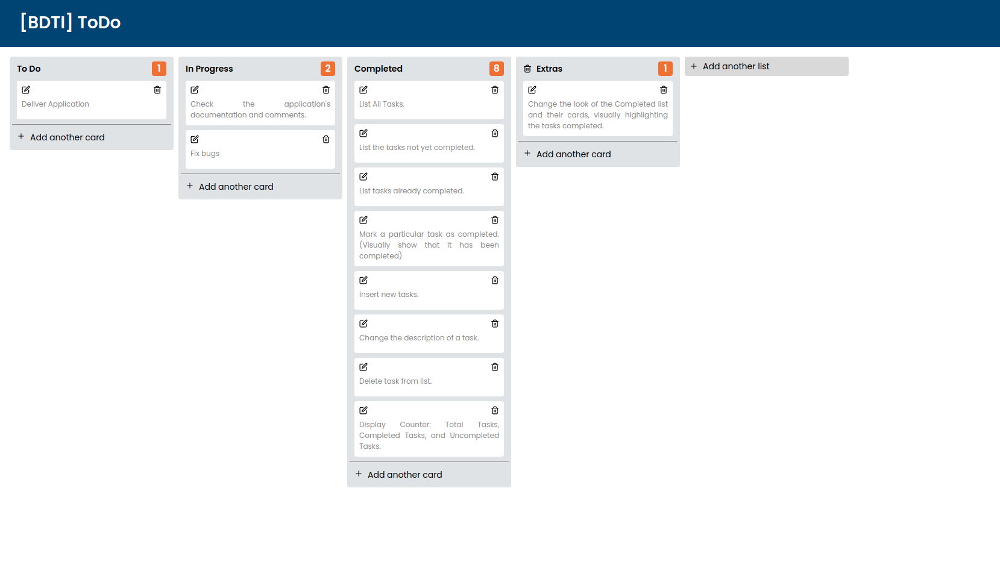
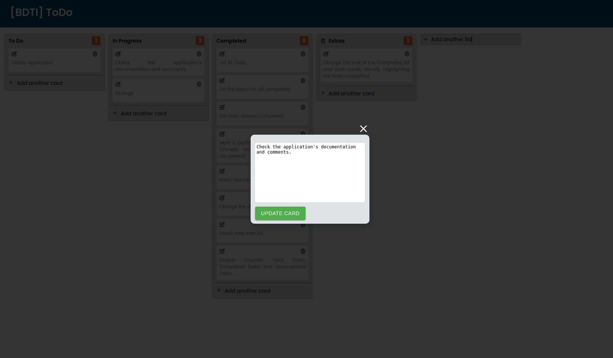

<h3 align="center">
 
🚧 Avaliação React em andamento... 🚧
 
 

# BDTI ToDo List

 
 

## 💻 **Sobre o projeto**

 

Desenvolvimento de teste de avaliação React, consistindo na criação de uma aplicação de lista de tarefas (todo list) utilizando o redux para armazenar os estados da aplicação.

Documentação do projeto: [BDTI-ToDo List](https://www.notion.so/Next-Level-Week-5-1-Dia-d4487ff53f0f4130b9077d1a5deaecfe)

   

## 📖 **Tabela de conteúdos**

 

- [Sobre o projeto](#-sobre-o-projeto)
- [Tabela de Conteúdo](#-tabela-de-conteúdos)
- [Escopo](#-escopo)
- [Etapas de desenvolvimento](#-etapas-de-desenvolvimento)
- [Layout](#-layout)
- [Escolha das Ferramentas](#-escolha-das-ferramentas)
- [Desenvolvimento da aplicação](#-desenvolvimento-da-aplicação)

 

## 🔩 **Escopo**

Crie, utilizando React com Redux, uma lista de tarefas (Todo), onde deverá ser possível:

- [x] Listar Todas as Tarefas
- [x] Listar as tarefas ainda não concluídas
- [x] Listar as tarefas já concluídas
- [x] Marcar determinada tarefa como concluída (Mostrar visualmente que foi concluída)
- [x] Inserir novas tarefas
- [x] Alterar a descrição de uma tarefa
- [x] Excluir tarefa da lista
- [x] Exibir contadores: Total de tarefas, Tarefas concluídas e Não concluídas

Obs[1]: As tarefas deverão ser armazenadas no LocalStorage do navegador

Obs[2]: Utilizar redux para controlar o estado da aplicação

Obs[3]: Aplicar comentários explicando cada função utilizada

Obs[4]: Design/Layout livre

Pontos que serão avaliados:

- Qualidade do Código
- Design/Layout da aplicação
- Componentização

## 📋 **Etapas de desenvolvimento**

- [x] Definir layout da aplicação
- [x] Escolhas das ferramentas
  - [x] Definir e justificar o uso das ferramentas
- [ ] Desenvolvimento da aplicação
  - [x] Implementação do layout
  - [x] Criar o controle de estado com Redux
  - [x] Criar regras de negócio
  - [x] Salvar as tarefas no LocalStorage
  - [] Checar os comentários de cada função

 

## 🎨 **Layout**

 

- A aplicação terá um cabeçalho contendo o título.
- A aplicação deverá ter uma lista de tarefas a fazer, tarefas em progresso, tarefas pausadas e tarefas concluídas.
- O usuário poderá adicionar novas listas.
- O usuário poderá mover as tarefas entre as listas.
- O usuário poderá excluir uma tarefa.
- O usuário poderá editar a tarefa.
- A lista deverá apresentar a quantidade de tarefas existentes.
- A clicar sobre uma tarefa, o card deverá apresentar todas as informações contidas e permitir a sua alteração.

 

  
  
   
  Layout da página principal da aplicação.
   
   

  
  
   
  Layout do cartão de tarefas.
   
   

## 🛠 **Escolha das ferramentas**

 

A aplicação deverá ser desenvolvida utilizando-se o ReactJS e Redux conforme o escopo do teste, a linguagem a ser utilizada será o javascript.

Para configuração do store Redux utilizarei a ferramenta ReduxJS Toolkit. Quanto a persistencia dos dados no localStore vou utilizar a biblioteca Redux Persist.

A geração dos ids, tando do cartão quanto das listas ficará a cargo do UUID, gerando números únicos para cada.

Para a estilização optei pelo styled-component, uma vez que permite a escrita css simples para seus componentes e evita colisões de nomes de classes. Ele ajuda na escrita do css com escopo definido para um único componente e não se aplica em nenhum outro elemento da página.

Quanto aos icones utilizados utilizarei a biblioteca React-icons pela sua flexibilidade e praticidade na utilização, permitindo a sua estilização de uma maneira simples.

Para a construção do botão de adição utilizarei a biblioteca Material UI.

A estilização do modal de cartão, para a alteração dos dados utilizarei o react-spring, ele será responsável pela animação do modal.

Para os cartões, farei uso do React Textarea Autosize, ele facilita o redimensionamente da área de texto do nosso cartão.

Para a função de arrastar os cards entre as lista optei por utilizar o React Beautiful DnD, sendo um utilitário que ajuda na construção de interfaces complexas do tipo arrasta e solta (drag and drop). Este utilitário permite escrever componentes desacoplados, permitindo arrastar os componentes cards entre diferentes listas da aplicação e permitindo alterações de sua aparência e dos estados da aplicação em resposta ao evento arrastar e soltar.

Ferramentas:

- Javascript
- ReactJS
- Redux
- ReduxJs Toolkit
- Redux Persist
- UUID

- Styled-Components
- React-icons
- React-Beautiful-DnD
- Material-UI
- React-Spring

 

## 🏋️‍♂️ **Desenvolvimento da aplicação**

### Implementação do Layout

A aplicação possui 4 componentes básicos:

- [x] Cabeçalho
- [x] Painel de controle
- [x] Lista
- [x] Cartão
- [x] Cartão Modal
- [x] Botão de Adicionar Listar
- [x] Botão de Adicionar Cartão

 

## Ricardo Granvilla Oliveira

 
 
